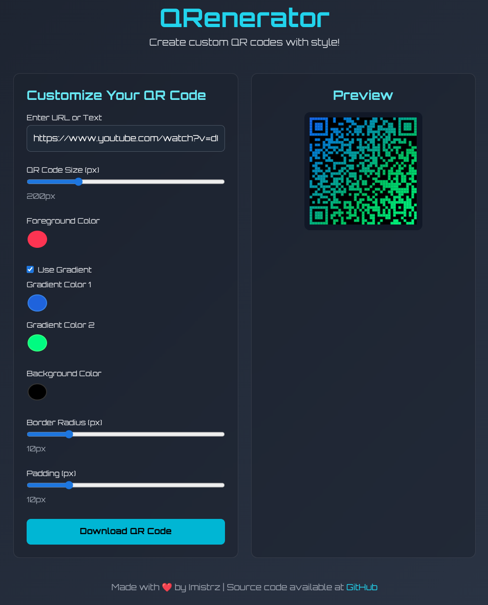

# QRenerator - Custom QR Code Generator

QRenerator is a stylish and customizable QR code generator. It allows you to create personalized QR codes with various customizations, such as color, size, gradients, and more. Whether you need a QR code for a website, contact info, or any other text, QRenerator makes it easy and fun to create the perfect QR code.

The project is built with HTML, CSS, and JavaScript, with a focus on clean code and a user-friendly experience. JavaScript and CSS are organized into separate files (`script.js` and `style.css`) for better maintainability. The JavaScript code is structured modularly to handle DOM manipulation, event listening, QR code generation, and UI updates efficiently.

[Live Demo - QRenerator](https://imistrz21.github.io/qrenerator/)

## Features

- **Customizable QR Code**: Enter a URL or plain text and adjust the QR code's size and colors.
- **Gradient Support**: Apply a gradient to the foreground of your QR code.
- **Real-Time Preview**: See the changes as you customize the QR code.
- **Downloadable QR Code**: Save your generated QR code as a PNG image.
- **User-Friendly Interface**: Simple controls for customization with a modern design.
- **Error Handling**: Improved error display for invalid inputs or QR code generation issues.
- **Accessibility (A11y)**: Enhanced accessibility with ARIA attributes for screen readers and improved keyboard navigation focus.

## How It Works

1. **Enter Text**: Input the URL or text you want to encode into a QR code.
2. **Customize**:
   - Adjust the **size** of the QR code.
   - Change the **foreground** and **background** colors.
   - Apply a **gradient** to the foreground color (optional).
   - Adjust the container's **border radius** and **padding** for a unique look (visual styling of the preview area).
3. **Preview & Download**: View your QR code in real time and download it once you're satisfied with the design.

## Development

This project uses [Prettier](https://prettier.io/) for code formatting to maintain a consistent code style.

### Code Formatting

To format the code, run the following command from the root of the project:

```bash
npm run format
```

This will format HTML, CSS, JavaScript, JSON, and Markdown files. Ensure you have Node.js and npm installed to use this command.

## Live Demo

You can try out the live version of QRenerator here:  
[QRenerator - Live Demo](https://imistrz21.github.io/qrenerator/)

## Screenshots


_Note: The screenshot might not reflect the very latest UI tweaks if any minor visual changes occurred during refactoring that are not central to the functionality._
